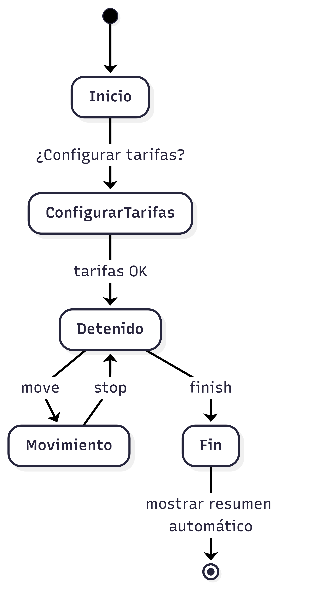
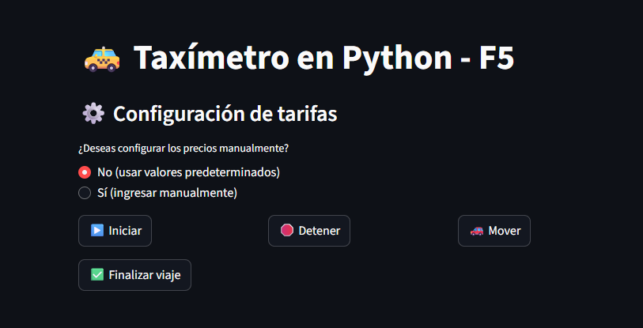

<p align="center">
  
</p>

# 🚖 Taxímetro Digital F5 – 

## 🖥️ Simulador de Tarifa con Python y Streamlit
Taxímetro F5 es una aplicación  que simula un taxímetro digital, permitiendo iniciar y gestionar un viaje desde la línea de comandos o una interfaz web desarrollada con Streamlit. Calcula el costo del trayecto según el estado del vehículo: detenido o en movimiento.

¿Qué hace esta aplicación?
Este proyecto implementa un taxímetro digital funcional con dos formas de interacción:

Interfaz de línea de comandos (CLI)

Interfaz web (Streamlit)


## 🧭 Diagrama del Flujo del Viaje

<p align="center">
  
</p>


```bash
graph TD
   stateDiagram-v2
    [*] --> Inicio
    Inicio --> ConfigurarTarifas : ¿Configurar tarifas?
    ConfigurarTarifas --> Detenido : tarifas OK
    Detenido --> Movimiento : move
    Movimiento --> Detenido : stop
    Detenido --> Fin : finish
    Fin --> [*] : mostrar resumen automático
```

## 🔧 Funcionalidades destacadas

```bash
✅ Simulación del cálculo de tarifa de un taxi.

🖥️ Dos interfaces disponibles: consola y aplicación web.

🔄 Cambio dinámico de estado del vehículo (detenido / en movimiento).

⏱️ Cálculo automático de costos basado en el tiempo en cada estado.

💰 Selección de tarifa personalizada: el usuario puede elegir una tarifa específica entre las disponibles o continuar con una tarifa por defecto.

📊 Visualización clara de los datos del viaje (tiempo, estado, costo actual).
```

## 🧩 Estructura del Proyecto

| Archivo         | Descripción |
|----------------|-------------|
| `core.py`      | Lógica principal del taxímetro |
| `logger.py`    | Configuración del sistema de logging |
| `taxímetro.py` | Interfaz de línea de comandos |
| `app.py`       | Interfaz web con Streamlit |
| `taxímetro.log`  | Registro automático de eventos y estados del sistema durante la ejecución |
| `historial.txt`  | Archivo de texto que guarda los trayectos pasados |


---

##  🖥️ Modo 1: Línea de Comandos

Ejecuta el archivo `taximetro.py` para usar el taxímetro desde la terminal:

```bash
python taximetro.py

## 🧾 Comandos Disponibles en la Terminal

| Comando  | Acción                                 |
| -------- | -------------------------------------- |
| `start`  | Inicia el viaje                        |
| `stop`   | Cambia a estado detenido               |
| `move`   | Cambia a estado en movimiento          |
| `finish` | Finaliza el viaje y muestra el resumen |
| `exit`   | Sale del programa                      |


```

## 🌐 Modo 2: Interfaz Web con Streamlit
```bash

- Instala Streamlit si no lo tienes:
pip install streamlit

- Ejecuta la app:
streamlit run taximetro_streamlit.py

Desde la interfaz podrás:
- Configurar tarifas personalizadas
- Iniciar, detener y mover el vehículo
- Finalizar el viaje y ver el resumen

```

💵 Cálculo de Tarifa
```bash
- Tarifa por segundo detenido: 0.02 (por defecto)
- Tarifa por segundo en movimiento: 0.05 (por defecto)
Puedes personalizar estos valores desde la terminal o la interfaz web.
```

📝 Requisitos
```bash
- Python 3.7 o superior
- Streamlit (solo para la interfaz web)
```

📦 Instalación
```bash
git clone https://github.com/tu_usuario/taximetro.git
cd taximetro
python -m venv venv
source venv/bin/activate  # En Windows: venv\Scripts\activate
pip install -r requirements.txt  # Si lo tienes
```

🧾 Logging
```bash
Todos los eventos se registran en taxímetro.log con distintos niveles  (INFO, DEBUG, WARNING),
lo que facilita la depuración y el seguimiento del uso.
```


## 🤝 Contribuciones
```bash
¡Las contribuciones son bienvenidas! Abre un issue o haz un fork y crea un pull request.
```

## 🌄 Vista Previa Interfaz Web 

<p align="center">
  
</p>


A lo largo del viaje, el usuario puede alternar el estado del vehículo entre detenido y en movimiento, y el sistema calculará la tarifa total considerando el tiempo transcurrido en cada estado.


## 👤 Autor
Desarrollado por [Lazaroth93](https://github.com/Lazaroth93)
```
